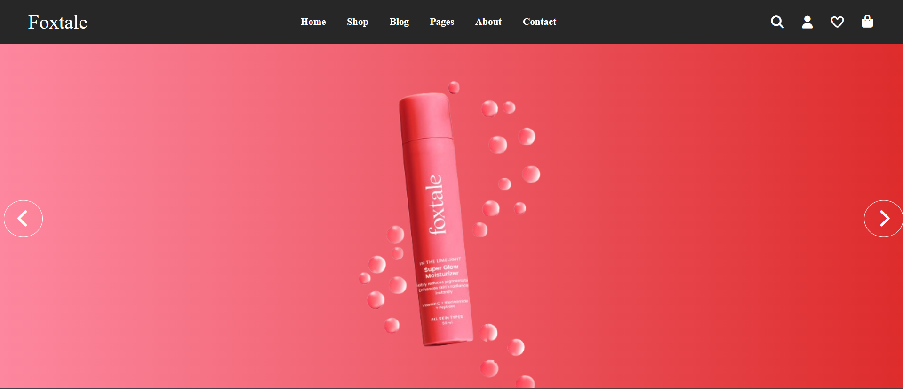
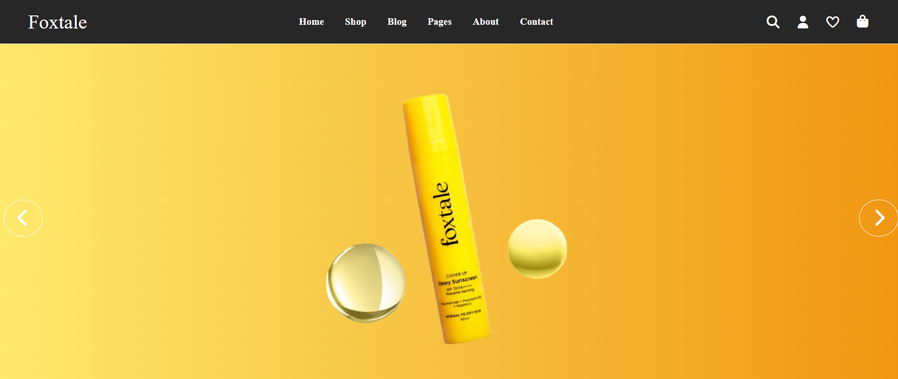
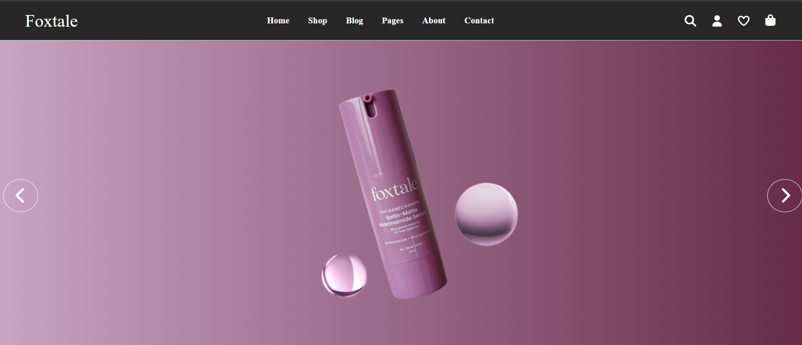

# 📸 PROJECT-SLIDER

A clean and responsive image slider made using **HTML**, **CSS**, and **JavaScript**.

## 📂 Project Structure

PR-7-SLIDER/
├── index.html         # Main HTML file
├── css/
│   ├── style.css      # Custom styles
│   └── all.min.css    # Font Awesome icons (if used)
├── js/
│   └── script.js      # Slider functionality
├── imgs/              # Product images
├── webfonts/          # Icon font files
└── README.md          # Project info

## 🚀 Features

- Simple and clean layout  
- Sliding image carousel  
- Custom CSS and JavaScript  
- Responsive design  

## 🧑‍💻 How to Run

1. Download or clone the project.  
2. Open `index.html` in your browser.  
3. Enjoy the image slider!

## 🛠️ Built With

- HTML5  
- CSS3  
- JavaScript (Vanilla)  
- Font Awesome (for icons, if used)

## 📸 Preview

